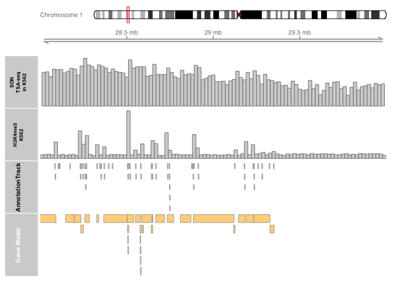

Gviz\_tutorial
================
Omid Gholamalamdari
5/31/2019

## Introduction

This document is describing how to create genomic plots Gviz library
from Bioconductor. Detailed behavior of the following functions can be
found on [Gviz
Vignette](https://bioconductor.org/packages/release/bioc/vignettes/Gviz/inst/doc/Gviz.html)

On May 31st 2019 I made this small tutorial for Franziska Lorbeer, as
part of her 2019 birthday’s rituals\!

Happy birthday **Franzi**\!\! Wish that you see less number of error
screens as you age\!

Omid.

### Importing files

``` r
son_tsa<-import("./sample_file/k562_c1r1_20k_mw20k_hg38.bw")
h3k4me<-import("./sample_file/k562_h3k4me3_20kb.bw")
```

### Adding chromosome axis and ideogram

``` r
gtrack <- GenomeAxisTrack(labelPos="above")
itrack <- IdeogramTrack(genome = "hg38")
```

### Adding BW in histogram style

``` r
son_tsa_tr<-DataTrack(son_tsa,name="SON TSA-seq in K562",type="hist",
                      showAxis=F,fontsize=10,rotation.title=90,
                      col.title="black")
h3k4me3_tr<-DataTrack(h3k4me,name="H3K4me3 K562",type="hist",
                      showAxis=F,fontsize=10,rotation.title=90,
                      col.title="black")
```

### Adding annotation (e.g. Bed Files or gene models)

``` r
#Gene models

txdb <- TxDb.Hsapiens.UCSC.hg38.knownGene

## I could only tame this by specifying the coordinates in the function. Don't know why!
genes_tr <- GeneRegionTrack(txdb, name="Gene Model",chromosome="chr1", start=28e6, end=30e6)

## BED file
bed_h3k4me3<-import("./sample_file/H3K4me3_ENCFF148POZ_hg38.bed")
bed_tr<-AnnotationTrack(bed_h3k4me3,col.title="black")
```

### Visualizing

``` r
plotTracks(c(itrack,gtrack,son_tsa_tr,h3k4me3_tr,bed_tr,genes_tr), from =28e6, to=30e6, chromosome = "chr1",collapseTranscripts=T)
```

<!-- -->
